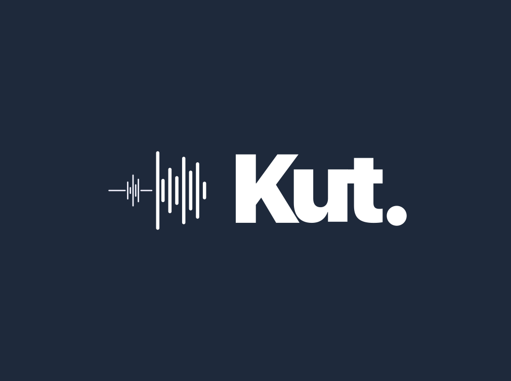

<p align="center">
  
</p>

<h1 align="center">KutEditor</h1>

<p align="center">
  <strong>El editor de podcasts nativo, profesional y multiplataforma.</strong><br>
  <em>The native, professional, cross-platform podcast editor.</em>
</p>

<p align="center">
  <a href="#-características--features"></a>
  <a href="#-compilación--build"></a>
  <a href="#-licencia--license"></a>
  <a href="#-donaciones--support"></a>
</p>

---

## 🌐 Idioma / Language

- [🇪🇸 Español](#-español)
- [🇬🇧 English](#-english)

---

# 🇪🇸 Español

## 📖 Acerca de

**KutEditor** es el entorno nativo de escritorio para creadores de podcasts de la suite **KutStudio**. Diseñado desde cero para agilizar el flujo de trabajo de producción, integra edición de audio multipista, procesamiento de efectos en tiempo real, transcripción con IA, gestión de metadatos y publicación directa — todo bajo una misma interfaz fluida e intuitiva construida con **Qt 6** y **QML**.

No es un DAW genérico: KutEditor está optimizado exclusivamente para el flujo de trabajo de un podcaster.

## ✨ Características Principales

### 🎙️ Edición de Audio
- **Editor Multipista** con forma de onda GPU-acelerada (compute shaders para mipmaps)
- **Grabación y reproducción** vía JACK (Linux) / CoreAudio (macOS) / WASAPI (Windows)
- **Motor de audio de alto rendimiento** con buffers mapeados en memoria (mmap)
- **Resampleo de alta calidad** con libsamplerate (48 ↔ 44.1 kHz)

### 🎛️ Efectos de Audio Profesionales
| Efecto | Descripción |
|--------|-------------|
| Compresor | Control dinámico de rango |
| Limitador | Protección contra clipping |
| Puerta de ruido | Eliminación de ruido de fondo |
| De-Esser | Reducción de sibilancia |
| DeNoiser (RNNoise) | Reducción de ruido con redes neuronales |
| DeepFilterNet | Reducción de ruido avanzada con IA |
| Ecualizador | EQ paramétrico completo |
| Expansor | Expansión dinámica |
| Auto-Duck | Atenuación automática de música bajo la voz |
| Auto-Gain | Nivelación automática de volumen |
| Filtros (HP/LP/Notch) | Filtros de paso alto, paso bajo y notch |
| Stereo Widener | Ampliación del campo estéreo |
| Phase Invert | Inversión de fase |
| Mono Mixer | Mezcla a mono |
| Trim Gain | Ajuste de ganancia |

### 🤖 Transcripción con IA
- Transcripción automática con **whisper.cpp** (con soporte GPU: Vulkan para AMD/Intel, CUDA para NVIDIA)
- Reducción de ruido previa con **RNNoise** para mejorar la calidad de transcripción
- Exportación de transcripciones en formatos SRT/VTT

### 📑 Capítulos y Metadatos
- Soporte completo para **capítulos Podcasting 2.0**
- Escritura de **CHAP frames ID3v2** con artwork embebido (vía TagLib)
- Editor visual de capítulos y marcadores
- Arte de portada por episodio

### 🌐 Integración con KutPod
- Conexión directa al servidor **KutPod** mediante API REST
- Publicación de episodios con un solo clic
- Gestión de múltiples shows y cuentas
- Programación de publicaciones
- Biblioteca online integrada

### 📦 Exportación
- Exportación a MP3, WAV y AAC
- Configuración de metadatos completa
- Flujo de trabajo optimizado para publicación

## 🔧 Dependencias

### Obligatorias
| Dependencia | Versión | Propósito |
|-------------|---------|-----------|
| **Qt 6** | 6.x | Framework UI (Core, Quick, Widgets, Network, ShaderTools...) |
| **CMake** | ≥ 3.16 | Sistema de compilación |
| **JACK** (Linux) | - | API de audio (compatible con `pipewire-jack`) |

### Opcionales
| Dependencia | Propósito | Fallback |
|-------------|-----------|----------|
| **libsamplerate** | Resampleo de alta calidad | Resampleo lineal (menor calidad) |
| **TagLib** | Capítulos con artwork embebido | Capítulos sin artwork |
| **whisper.cpp** | Transcripción con IA | Transcripción desactivada |
| **RNNoise** | Reducción de ruido | Se compila desde fuente automáticamente |
| **DeepFilterNet** | Reducción de ruido avanzada | Se desactiva |

## 🚀 Compilación e Instalación

### Linux

#### Método Automático (recomendado)

```bash
cd kuteditor_linux
./installer.sh
```

El instalador detecta automáticamente tu distribución y empaqueta nativamente:
- **Arch Linux / Manjaro / CachyOS**: Crea e instala un paquete con `makepkg -si`
- **Debian / Ubuntu / Mint**: Genera un `.deb` con CPack
- **Fedora / RHEL / openSUSE**: Genera un `.rpm` con CPack
- **Otras distros**: Compila e informa cómo instalar manualmente

#### Método Manual

```bash
cd kuteditor_linux

cmake -S . -B build \
  -DCMAKE_BUILD_TYPE=Release \
  -DHAVE_WHISPER=ON \
  -DHAVE_KUTPOD=ON

cmake --build build -j$(nproc)
sudo cmake --install build
```

#### Opciones de CMake

| Opción | Default | Descripción |
|--------|---------|-------------|
| `HAVE_WHISPER` | `AUTO` | Transcripción con whisper.cpp (`ON`, `OFF`, `AUTO`) |
| `HAVE_KUTPOD` | `ON` | Cliente de biblioteca online KutPod |
| `HAVE_DEEPFILTERNET` | `ON` | Reducción de ruido DeepFilterNet |

> [!NOTE]
> **Compatibilidad de Audio (JACK y PipeWire)**:
> KutEditor utiliza la API de JACK para la reproducción y grabación de audio.
> - Si tu distribución utiliza **PipeWire** por defecto (Arch, CachyOS, Fedora, Ubuntu reciente…), asegúrate de instalar **`pipewire-jack`** (reemplazará a `jack2`).
> - Si utilizas un servidor **JACK2** tradicional, inicia el servidor JACK antes de ejecutar la aplicación.

### macOS

```bash
cd kuteditor_macos

cmake -S . -B build \
  -DCMAKE_BUILD_TYPE=Release

cmake --build build -j$(sysctl -n hw.ncpu)

# Generar DMG
./build_dmg.sh
```

Requiere macOS 15.0 o superior. Utiliza **CoreAudio** nativo (no requiere JACK).

### Windows

```bash
cd kuteditor_windows

cmake -S . -B build ^
  -DCMAKE_BUILD_TYPE=Release

cmake --build build --config Release
```

Utiliza **WASAPI** nativo para audio.

## 🧩 Script de REAPER: Publish to KutPod

El repositorio incluye `publish_to_kutpod.lua`, un ReaScript para **REAPER** que permite publicar episodios directamente desde tu sesión de REAPER a KutPod:

- Interfaz ImGui integrada en REAPER
- Auto-extracción de capítulos desde los marcadores de REAPER
- Login con token Bearer
- Subida de audio, portada y transcripciones
- Programación de publicaciones

> Requiere la extensión **ReaImGui** instalada vía ReaPack.

## 🏗️ Arquitectura del Proyecto

```
kuteditor/
├── kuteditor_linux/     # Build específico para Linux (JACK + PipeWire)
├── kuteditor_macos/     # Build específico para macOS (CoreAudio + Sparkle)
├── kuteditor_windows/   # Build específico para Windows (WASAPI)
├── publish_to_kutpod.lua  # ReaScript para REAPER
└── kut.png              # Logo del proyecto
```

Cada carpeta de plataforma contiene:
```
├── CMakeLists.txt       # Configuración de compilación
├── src/
│   ├── main.cpp         # Punto de entrada
│   ├── audio/           # Motor de audio, JACK/CoreAudio, mipmaps, efectos
│   ├── ui/              # QML, modelos, componentes visuales
│   ├── io/              # Exportación, proyectos, capítulos
│   ├── net/             # Cliente API KutPod
│   ├── transcription/   # Whisper, RNNoise
│   └── shaders/         # Compute shaders (GPU mipmap)
├── resources/           # Iconos, desktop entries, assets
└── 3rdparty/            # Dependencias bundled
```

## 🌍 Parte de KutStudio

KutEditor es el compañero de escritorio de **KutPod** (backend/servidor). Ambos se sincronizan a través de tokens Bearer para que los creadores se enfoquen en el contenido, mientras la plataforma gestiona el almacenamiento, el feed RSS y ActivityPub.

---

# 🇬🇧 English

## 📖 About

**KutEditor** is the native desktop environment for podcast creators from the **KutStudio** suite. Built from scratch to streamline the production workflow, it integrates multitrack audio editing, real-time effects processing, AI transcription, metadata management, and direct publishing — all within a smooth, intuitive interface built with **Qt 6** and **QML**.

It's not a generic DAW: KutEditor is optimized exclusively for the podcaster workflow.

## ✨ Key Features

### 🎙️ Audio Editing
- **Multitrack editor** with GPU-accelerated waveforms (compute shaders for mipmaps)
- **Recording and playback** via JACK (Linux) / CoreAudio (macOS) / WASAPI (Windows)
- **High-performance audio engine** with memory-mapped buffers (mmap)
- **High-quality resampling** with libsamplerate (48 ↔ 44.1 kHz)

### 🎛️ Professional Audio Effects
| Effect | Description |
|--------|-------------|
| Compressor | Dynamic range control |
| Limiter | Clipping protection |
| Noise Gate | Background noise elimination |
| De-Esser | Sibilance reduction |
| DeNoiser (RNNoise) | Neural network noise reduction |
| DeepFilterNet | Advanced AI noise reduction |
| Equalizer | Full parametric EQ |
| Expander | Dynamic expansion |
| Auto-Duck | Automatic music ducking under voice |
| Auto-Gain | Automatic volume leveling |
| Filters (HP/LP/Notch) | High-pass, low-pass, and notch filters |
| Stereo Widener | Stereo field expansion |
| Phase Invert | Phase inversion |
| Mono Mixer | Mono downmix |
| Trim Gain | Gain adjustment |

### 🤖 AI Transcription
- Automatic transcription with **whisper.cpp** (GPU support: Vulkan for AMD/Intel, CUDA for NVIDIA)
- Pre-processing noise reduction with **RNNoise** for improved transcription quality
- Transcript export in SRT/VTT formats

### 📑 Chapters & Metadata
- Full **Podcasting 2.0 chapter** support
- **ID3v2 CHAP frame** writing with embedded artwork (via TagLib)
- Visual chapter and marker editor
- Per-episode cover art

### 🌐 KutPod Integration
- Direct connection to **KutPod** server via REST API
- One-click episode publishing
- Multi-show and multi-account management
- Scheduled publishing
- Integrated online library

### 📦 Export
- Export to MP3, WAV, and AAC
- Full metadata configuration
- Optimized publishing workflow

## 🔧 Dependencies

### Required
| Dependency | Version | Purpose |
|------------|---------|---------|
| **Qt 6** | 6.x | UI framework (Core, Quick, Widgets, Network, ShaderTools…) |
| **CMake** | ≥ 3.16 | Build system |
| **JACK** (Linux) | - | Audio API (compatible with `pipewire-jack`) |

### Optional
| Dependency | Purpose | Fallback |
|------------|---------|----------|
| **libsamplerate** | High-quality resampling | Linear resampling (lower quality) |
| **TagLib** | Chapters with embedded artwork | Chapters without artwork |
| **whisper.cpp** | AI transcription | Transcription disabled |
| **RNNoise** | Noise reduction | Auto-compiled from source |
| **DeepFilterNet** | Advanced noise reduction | Disabled |

## 🚀 Build & Install

### Linux

#### Automatic Method (recommended)

```bash
cd kuteditor_linux
./installer.sh
```

The installer auto-detects your distribution and creates native packages:
- **Arch Linux / Manjaro / CachyOS**: Builds and installs via `makepkg -si`
- **Debian / Ubuntu / Mint**: Generates a `.deb` package via CPack
- **Fedora / RHEL / openSUSE**: Generates an `.rpm` package via CPack
- **Other distros**: Compiles and shows manual install instructions

#### Manual Method

```bash
cd kuteditor_linux

cmake -S . -B build \
  -DCMAKE_BUILD_TYPE=Release \
  -DHAVE_WHISPER=ON \
  -DHAVE_KUTPOD=ON

cmake --build build -j$(nproc)
sudo cmake --install build
```

#### CMake Options

| Option | Default | Description |
|--------|---------|-------------|
| `HAVE_WHISPER` | `AUTO` | whisper.cpp transcription (`ON`, `OFF`, `AUTO`) |
| `HAVE_KUTPOD` | `ON` | KutPod online library client |
| `HAVE_DEEPFILTERNET` | `ON` | DeepFilterNet noise reduction |

> [!NOTE]
> **Audio Compatibility (JACK & PipeWire)**:
> KutEditor uses the JACK API for audio playback and recording.
> - If your distro uses **PipeWire** by default (Arch, CachyOS, Fedora, recent Ubuntu…), make sure to install **`pipewire-jack`** (this will replace `jack2`).
> - If you use a traditional **JACK2** server, start the JACK server before running the app.

### macOS

```bash
cd kuteditor_macos

cmake -S . -B build \
  -DCMAKE_BUILD_TYPE=Release

cmake --build build -j$(sysctl -n hw.ncpu)

# Generate DMG
./build_dmg.sh
```

Requires macOS 15.0 or later. Uses native **CoreAudio** (no JACK required).

### Windows

```bash
cd kuteditor_windows

cmake -S . -B build ^
  -DCMAKE_BUILD_TYPE=Release

cmake --build build --config Release
```

Uses native **WASAPI** for audio.

## 🧩 REAPER Script: Publish to KutPod

The repository includes `publish_to_kutpod.lua`, a ReaScript for **REAPER** that lets you publish episodes directly from your REAPER session to KutPod:

- ImGui interface embedded in REAPER
- Auto-extraction of chapters from REAPER markers
- Bearer token authentication
- Upload audio, cover art, and transcripts
- Scheduled publishing

> Requires the **ReaImGui** extension installed via ReaPack.

## 🏗️ Project Architecture

```
kuteditor/
├── kuteditor_linux/     # Linux-specific build (JACK + PipeWire)
├── kuteditor_macos/     # macOS-specific build (CoreAudio + Sparkle)
├── kuteditor_windows/   # Windows-specific build (WASAPI)
├── publish_to_kutpod.lua  # ReaScript for REAPER
└── kut.png              # Project logo
```

Each platform folder contains:
```
├── CMakeLists.txt       # Build configuration
├── src/
│   ├── main.cpp         # Entry point
│   ├── audio/           # Audio engine, JACK/CoreAudio, mipmaps, effects
│   ├── ui/              # QML, models, visual components
│   ├── io/              # Export, projects, chapters
│   ├── net/             # KutPod API client
│   ├── transcription/   # Whisper, RNNoise
│   └── shaders/         # Compute shaders (GPU mipmap)
├── resources/           # Icons, desktop entries, assets
└── 3rdparty/            # Bundled dependencies
```

## 🌍 Part of KutStudio

KutEditor is the desktop companion to **KutPod** (backend/server). They sync through Bearer tokens so creators can focus on content while the platform handles storage, RSS feed, and ActivityPub.

---

# 💖 Donaciones / Support

Si KutEditor te es útil en tu flujo de trabajo como podcaster, considera apoyar el desarrollo con una donación. ¡Cada aporte ayuda a mantener el proyecto vivo y en constante mejora!

If KutEditor is useful in your podcasting workflow, consider supporting development with a donation. Every contribution helps keep the project alive and constantly improving!

<p align="center">

  <a href="https://paypal.me/elav">
    
  </a>
  &nbsp;&nbsp;
  <a href="https://www.buymeacoffee.com/ernestoacostame">
    
  </a>
  &nbsp;&nbsp;
  <a href="https://ko-fi.com/ernestoacostame">
    
  </a>

</p>

---

## 📄 Licencia / License

Este proyecto está licenciado bajo la **GPL (GNU General Public License)**.

This project is licensed under the **GPL (GNU General Public License)**.

---

<p align="center">
  Hecho con ❤️ para podcasters · Made with ❤️ for podcasters
</p>
